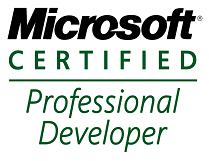

My name is Marcin Juraszek and I’m a Software Enginneer. I blog mostly about programming: open source projects I started and/or contribute to, interesting problems I find on [stackoverflow](http://stackoverflow.com/) and those I face myself during my coding.

If you’d like to contact me you can find me on  twitter or you can send an email to [mail@marcinjuraszek.com](mailto:mail@marcinjuraszek.com).

### Work experience

I’m proud to say **I work as Software Engineer at Microsoft**. Being a part of that  well known, great company and working in its headquarters in Redmond, WA give me opportunity to grow and learn from some of smartest people in the world. The fact that my job affects millions of people all around the world makes it both really exiting and challenging, and maybe that’s why I’m really happy to work there!

Before I started working for MSFT **I had worked as Software Engineer in Future Processing** – great polish software company – for over two years. Experience and knowledge I gathered during that time is priceless and I’m really glad I could work in the great company, with many really smart and valuable people.

### Education

My higher education includes 7-semester full-time **Bachelor of Science** studies and 3-semester full-time **Master of Science** in Computer Science at **[Silesian University of Technology in Gliwice](http://www.polsl.pl/en/), Poland**. Studies included issues related to the programming, software engineering, databases, algorithms, etc., which provide solid preparation for a substantive work of the software developer.

### Certifications

I’ve successfully completed the requirements to be recognized as a Microsoft Certified Professional.

Certification includes following exams I passed:
- MCPD: Windows Phone, Development ([70-599 Pro](http://www.microsoft.com/learning/en/us/exam.aspx?id=70-599))
- MCTS: Silverlight 4, Development ([70-506 TS](http://www.microsoft.com/learning/en/us/exam.aspx?id=70-504))
- MCTS: .NET Framework 4, Data Access ([70-516 TS](http://www.microsoft.com/learning/en/us/exam.aspx?id=70-516))
- MCS: Programming in C# Specialist ([70-483 S](http://www.microsoft.com/learning/en/us/exam.aspx?id=70-483))